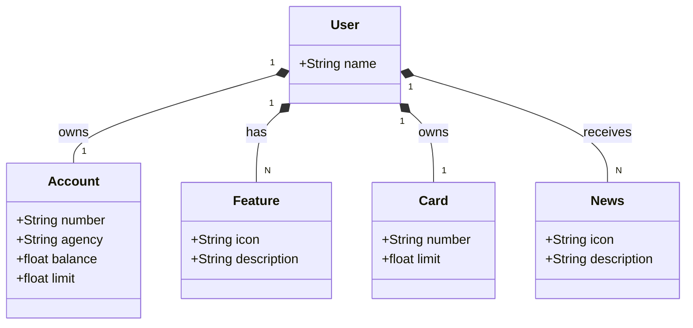

# Projeto em Java

## Diagrama de classes

```mermaid

classDiagram
    class User {
        +String name
    }
    
    class Account {
        +String number
        +String agency
        +float balance
        +float limit
    }
    
    class Feature {
        +String icon
        +String description
    }
    
    class Card {
        +String number
        +float limit
    }
    
    class News {
        +String icon
        +String description
    }
    
    User "1" *-- "1" Account : owns
    User "1" *-- "N" Feature : has
    User "1" *-- "1" Card : owns
    User "1" *-- "N" News : receives

```
